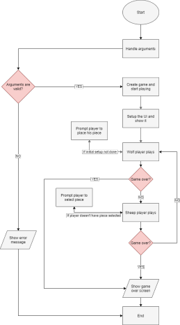

# Wolf and Sheep

**Project 1 - Linguagens de Programação I 2019/2020**

**Videojogos - Universidade Lusófona**

### Authors

#### Pedro Dias Marques - 21900800

- Argument handling;
- Game logic;
- Player logic;
- User interface.

#### Pedro Fernandes - 21908084

- Board logic;
- Piece logic;
- Coordinates system;
- Report.

**Github:** [Link](https://github.com/p-marques/WolfSheepLP1)

## Solution Architecture

### Flowchart

