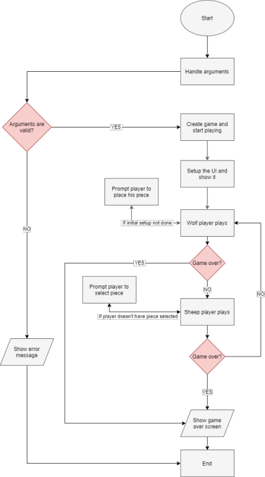
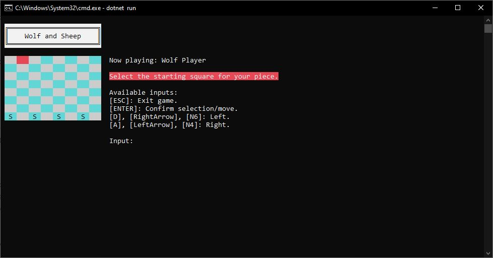
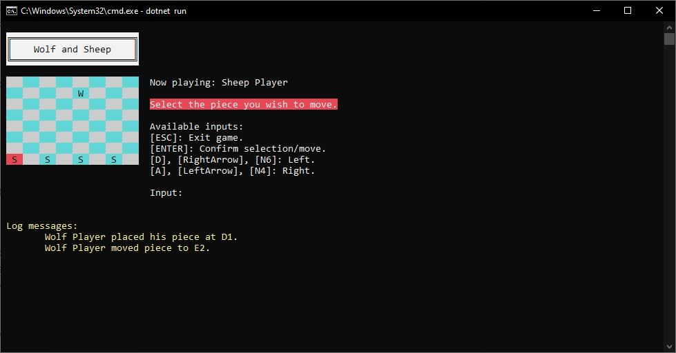

# Wolf and Sheep

**Project 1 - Linguagens de Programação I 2019/2020**

**Videojogos - Universidade Lusófona**

### Authors

#### Pedro Dias Marques - 21900800

- Argument handling;
- Game logic;
- Player logic;
- User interface.

#### Pedro Fernandes - 21908084

- Board logic;
- Piece logic;
- Coordinates system;
- Report.

**Github:** [Link](https://github.com/p-marques/WolfSheepLP1)

## Solution Architecture

### Flowchart

## Program resume
    The game starts with the commands in the commands line (dotnet run). With the start of the game the program verifies the arguments, if valid the game is created, if not the errors are showed, and the program ends. After created, the UI sets up, and the wolf player will be able to chose where to start, using the arrow keys left and right to choose the position and the enter key to selected it. After this the game loop starts. 

    
    Each loop is a turn, the wolf player plays starts first being able to move to each corner, then the sheep player choosing what sheep to move and what corner to move it(only forth).with every action the visualization updates. 

    The loop stops when the game finish, for that to happen the wolf as to get to the sheep’s side of board, or the sheep’s block every passage of the wolf, or the player clicks the “esc” bottom. When the games endds the program will show who won and with how many moves.

## Classes
### Program
This is where the program starts. 
### Game

### Board
    This class stores an array of rows. the size of the array is the variable Size. It can create said array, set the initial table, move pieces, get the available plays for the current player, verifying the possible piece movements and squares available, it can also get verify witch player won.
### BoardRow
    An array of Squares, and it can look for all the squares available:
### BoardSquare
    Can place a piece in here, has if it is available and its position.
### Piece
    This class has the code for the piece, having also the square of where it is.
### SheepPiece
    Changes the code of the piece to "S".
### WolfPiece
    Changes the code of the piece to "W".
### Player
    Checks if the player can go to the locations and has a counter of the plays
### SheepPlayer
    Creates a new player altering its allowed directions.
### WolfPlayer
    Same as the sheep class but with different directions.
### Coord
    This class establish a coordinate sytema of x(column) and y(row). 

## Comands
    The commands are treated by the class options. In there options. ParseOptionsFromArgs gets an array with the commands given the current player from ConsoleUserInterface. 